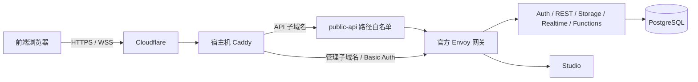

# Mybase：Supabase 本地 / 单机云部署

使用官方 `self-hosted/v0.8.2` 的固定版本配置，提供 PostgreSQL 17、Auth、REST、GraphQL、Realtime、Storage、Edge Functions、Studio 和连接池。通过 `.env` 配置，`make up` 启动。适合开发、试运行和能够接受单机停机的小型业务；不包含数据库高可用、自动扩缩容或托管运维。

## 快速开始

需要 Docker Engine、Docker Compose **2.24.4+**、GNU Make、Python **3.11+**，当前用户须有 Docker 权限。建议从 4 核、8 GB RAM、80 GB SSD 起步，并根据实际负载评估容量。

```bash
make up
```

第一次自动从 `.env.example` 创建权限 `0600` 的 `.env` 并生成随机密钥；之后不会覆盖已有非空变量。也可以先运行 `make init`，编辑 `.env`，再 `make up`。同时生成 `caddy/Caddyfile`，已有文件不覆盖。默认关闭新用户注册。首次下载镜像需要时间和可访问镜像仓库的网络。

| 入口 | 默认地址 | 用途 |
| --- | --- | --- |
| 业务 API | http://localhost:8000 | 前端 SDK；根路径返回 404 是预期行为 |
| Studio | http://localhost:8001 | 使用 `.env` 的 `DASHBOARD_USERNAME` / `DASHBOARD_PASSWORD` 登录 |
| Session 连接池 | 127.0.0.1:5432 | SQL 客户端、迁移 |
| Transaction 连接池 | 127.0.0.1:6543 | 服务端短连接 |

所有宿主机端口只监听 `127.0.0.1`。前端只使用 `SUPABASE_PUBLIC_URL` 和 `ANON_KEY`；`SERVICE_ROLE_KEY` 和数据库密码只能用于可信服务端。

```bash
make check                 # 配置校验，不打印密钥
make ps                    # 容器状态
make smoke                 # Auth / REST / 管理路径隔离检查
make integration           # 仅运行本地功能集成测试，临时数据自动清理
make logs SERVICE=auth     # 最近日志
make down                  # 停止，保留数据
make up                    # 重新启动 / 应用 .env 修改
make backup                # 有停机的一致性冷备份
make psql                  # 数据库终端
make test                  # 配置、安全边界和关键功能测试（需已启动）
make unit                  # 仅离线单元测试，无需 Docker
```

## 功能验收

```bash
make up && make test
```

`make test` 顺序运行 14 项离线测试和 11 项真实实例集成测试，覆盖 Auth 会话、REST CRUD/RLS、RPC、Storage 私有文件与签名下载、Realtime 事件/广播/Presence、Edge Functions、Studio 和两种 SQL 连接池。任何断言、服务连接或资源清理失败均返回非零退出码；服务未启动不会跳过集成测试。只需原有 Python 标准库及 Docker，无需安装 SDK 或宿主机 psql。

集成测试创建随机命名的临时用户、表、函数、bucket 和策略，正常结束或断言失败后逐项清理。SQL 连接池使用现有数据库镜像的临时客户端，经 Linux host 网络验证实际宿主机端口。未启用的 GraphQL 扩展及未配置的 SMTP、OAuth、公网 HTTPS 不属于通过范围。完整覆盖和运行说明见[测试说明](docs/testing.md)。

## 公网架构



推荐两个子域名：`api.example.com` → `127.0.0.1:8000`（业务 API），`admin.example.com` → `127.0.0.1:8001`（Studio，保留网关 Basic Auth）。API 保留 `/auth/v1`、`/rest/v1` 等原路径，Studio 使用独立域名的根路径。

`make init` 生成供**宿主机 Caddy** 使用的 `caddy/Caddyfile`，默认监听 `127.0.0.1:8080`，按 `api.localhost` / `admin.localhost` 分流。编辑其中域名后，使用 `caddy run --config caddy/Caddyfile --adapter caddyfile` 启动；`make up` 只管理 Supabase 容器。外部 HTTPS 入口保留原始 Host，证书与入口由你单独管理；本仓库不配置或启动 Tunnel。详见[部署说明](docs/deployment.md)。

## 文档

- [容器用途与主要配置项](docs/containers.md)：全部 12 个服务的职责、入口、关键参数与依赖。
- [当前实例功能与示例](docs/features.md)：数据库、认证、文件、实时通信、函数，以及需额外启用的能力。
- [部署与 Caddy](docs/deployment.md)：云主机、域名、回调、邮件和公网验收。
- [环境变量说明](docs/configuration.md)：默认值、密钥模式和配置修改边界。
- [前端与 SQL 使用](docs/usage.md)：Auth、RLS、Storage、Realtime、Functions 和报表连接。
- [运维、备份与恢复](docs/operations.md)：冷备份、恢复演练、升级、监控和迁移。
- [常见问题及替代方案](docs/troubleshooting.md)：故障排查与部署方案取舍。
- [验证记录](docs/verification.md)：实际完成与尚未验证的项目。
- [上游版本来源](UPSTREAM.md)：固定 commit 和原许可证。

配置文件不要提交 `.env`，不要运行 `docker compose down -v` 或删除 `volumes/db/data`。`make down` 不删除数据，但磁盘丢失仍会丢数据，请保存异地备份。
