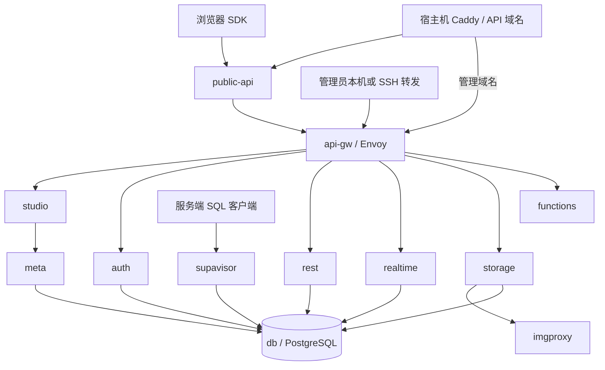

# 容器用途与主要配置项

本文对应本仓库的固定部署版本，依据 [基础 Compose](../docker-compose.yml)、[本地覆盖配置](../compose.override.yml) 和 [API 入口配置](../config/public-api.conf)。共有 **12 个默认服务**。表中的名称是 Compose 服务名，可以直接用于 `make logs SERVICE=auth` 等命令。

`.env` 中的变量通常会映射成容器内部的另一个名字，例如 `SITE_URL` → `GOTRUE_SITE_URL`。只有被 Compose 引用的变量才会传入服务；向 `.env` 随便新增变量不会自动改变容器。以下标为“Compose 固定项”的值需要在覆盖配置中修改，不能只改 `.env`。

## 1. 服务总览与调用关系

| 服务 | 用途 | 容器内入口 | 宿主机入口（默认） |
| --- | --- | --- | --- |
| `public-api` | Nginx 业务 API 白名单入口，隔离管理路径 | 8080 | `127.0.0.1:8000` |
| `api-gw` | Envoy 官方网关，按路径路由并执行 API key / Basic Auth 检查 | 8000 | `127.0.0.1:8001`，管理入口 |
| `studio` | Web 管理界面、SQL 编辑器、表/用户/文件管理 | 3000 | 无独立端口，经管理网关访问 |
| `auth` | 用户身份、登录会话、JWT、邮件认证流程 | 9999 | 经 `/auth/v1/` |
| `rest` | PostgREST，把数据库表、视图和函数映射为 HTTP API | 3000 | 经 `/rest/v1/`；也承接 GraphQL 转发 |
| `realtime` | 数据库变化订阅、广播、在线状态等 WebSocket 服务 | 4000 | 经 `/realtime/v1/` |
| `storage` | 文件 bucket、对象读写、签名 URL 与访问控制 | 5000 | 经 `/storage/v1/` |
| `imgproxy` | 为 Storage 提供图片转换 | 5001 | 无独立端口，由 Storage 调用 |
| `meta` | postgres-meta，为 Studio 提供数据库结构与管理接口 | 8080 | 无独立业务端口；公网 `/pg/` 被拒绝 |
| `functions` | 在 Deno Edge Runtime 中执行 TypeScript/JavaScript 函数 | 9000 | 经 `/functions/v1/` |
| `db` | PostgreSQL，保存业务表及各服务元数据 | 5432 | 不直接映射，由连接池提供 SQL 入口 |
| `supavisor` | 数据库连接池，复用到 PostgreSQL 的连接 | 5432 / 6543；4000 为内部管理/健康端口 | `127.0.0.1:5432` / `127.0.0.1:6543` |

这是主要调用关系示意，不表示所有服务必须经连接池访问数据库。当前 Auth、REST 等内部服务直接连接 `db`。

## 2. public-api：对前端开放的入口

镜像：`nginx:1.30.5-alpine`。业务 API 域名应转发到它，避免直接进入包含管理路由的官方网关。

| 配置项 | 位置与含义 |
| --- | --- |
| `PUBLIC_API_PORT` | `.env`：宿主机业务端口，默认 8000，仅绑定 127.0.0.1 |
| `location` 白名单 | `config/public-api.conf`：放行 Auth、REST、Storage、Functions、Realtime 业务路径及 `/graphql/v1`；其余返回 404 |
| `/realtime/v1/api` 拒绝规则 | 避免公开 Realtime 管理路径；也意味着通过该前缀的 REST 广播调用不能使用，业务广播应在已连接的 WebSocket channel 内发送 |
| `client_max_body_size 50m` | Nginx 请求体限制，需与 Storage 和 Cloudflare 限制配套调整 |
| `proxy_read_timeout` / `proxy_send_timeout` | 当前均为 3600 秒，是此代理层的超时，不代表整条请求链路均允许等待一小时 |
| `Cache-Control: no-store` | 请求结果不应被共享缓存；Cloudflare 仍需设置 API hostname 缓存绕过规则 |
| `resolver` / `resolve` | 通过 Docker DNS 更新上游容器地址，避免容器重建后继续使用旧 IP |

`/healthz` 仅检测 Nginx 存活，不检测数据库。配置文件被挂载到容器中，修改后执行 `docker compose -f docker-compose.yml -f compose.override.yml restart public-api` 重新加载。

## 3. api-gw：统一路由与入口鉴权

镜像：`envoyproxy/envoy:v1.39.1`。把 `/auth/v1/` 等路由分发到内部服务；业务用户的数据权限最终由各服务与数据库执行。

| 配置项 | 含义 |
| --- | --- |
| `STUDIO_PORT` | 本地覆盖配置实际使用的管理网关宿主机端口，默认 8001 |
| `SUPABASE_PUBLISHABLE_KEY` / `SUPABASE_SECRET_KEY` | 网关识别的两类 API key；后者具有管理权限 |
| `DASHBOARD_USERNAME` / `DASHBOARD_PASSWORD` | Studio 入口的 HTTP Basic Auth 凭证 |
| `SUPABASE_PUBLIC_URL` | 对外 API 地址，参与生成网关配置 |
| `volumes/api/envoy/lds.template.yaml` | 路由、过滤器、API key 与 Basic Auth 规则模板 |
| `volumes/api/envoy/cds.yaml` | 内部后端服务的地址与连接配置 |

`API_GW_HTTP_PORT`、`KONG_HTTP_PORT`、`KONG_HTTPS_PORT` 是模板保留的上游参数，当前入口端口已由 override 覆盖；本实例没有运行 Kong。新版 `/rest/v1/` 的 OpenAPI 根文档要求管理 key，不能用它判断 anon 访问业务表是否正常。

## 4. studio：管理员界面

镜像：`supabase/studio:2026.09.28-sha-5e59b60`。用来查看和编辑数据库、执行 SQL、管理用户和文件。Studio 管理员与 Auth 业务用户是不同身份体系。

| 配置项 | 含义 |
| --- | --- |
| `STUDIO_DEFAULT_ORGANIZATION` / `STUDIO_DEFAULT_PROJECT` | 页面展示名称，不会创建多组织、多项目控制平面 |
| `STUDIO_PG_META_URL=http://meta:8080` | Compose 固定项：数据库管理接口地址 |
| `SUPABASE_URL=http://api-gw:8000` | Compose 固定项：容器内部访问网关的地址 |
| `SUPABASE_PUBLIC_URL` | 浏览器/页面使用的外部业务 API 地址 |
| `POSTGRES_*` / `PG_META_CRYPTO_KEY` | 数据库连接信息与 Studio/meta 共享加密材料 |
| `OPENAI_API_KEY` | 可选 AI 辅助能力所需的外部服务密钥，当前为空 |
| `ENABLED_FEATURES_LOGS_ALL=false` | Compose 固定项：未启用完整日志聚合界面 |

`volumes/snippets` 保存 SQL 片段；`volumes/functions` 在 Studio 中以只读方式挂载。函数源码请在项目目录编辑，不要假设当前 Studio 可以直接保存函数文件。

## 5. auth：用户认证

镜像：`supabase/gotrue:v2.197.0`。保存用户和会话到数据库，签发业务用户 JWT，并处理注册、密码登录、确认邮件、找回密码等流程。

| `.env` 变量 | 容器内映射 / 含义 |
| --- | --- |
| `SITE_URL` | `GOTRUE_SITE_URL`：默认业务跳转地址 |
| `ADDITIONAL_REDIRECT_URLS` | `GOTRUE_URI_ALLOW_LIST`：额外允许的业务回调 URL |
| `API_EXTERNAL_URL` | Auth 对外地址，本版本包含 `/auth/v1` |
| `DISABLE_SIGNUP` | `GOTRUE_DISABLE_SIGNUP`：默认 true，阻止新用户自助注册 |
| `ENABLE_EMAIL_SIGNUP` | `GOTRUE_EXTERNAL_EMAIL_ENABLED`：邮箱认证能力开关 |
| `ENABLE_EMAIL_AUTOCONFIRM` | `GOTRUE_MAILER_AUTOCONFIRM`：是否跳过邮箱确认，默认 false |
| `JWT_KEYS` / `JWT_EXPIRY` | ES256 私钥与用户 JWT 有效秒数，默认一小时 |
| `SMTP_*` / `MAILER_URLPATHS_*` | 发信服务器、凭证、发件身份及验证链接路径 |
| `ENABLE_ANONYMOUS_USERS` | 是否创建匿名 Auth 用户，默认 false；不同于使用 anon API key |
| `ENABLE_PHONE_SIGNUP` / `ENABLE_PHONE_AUTOCONFIRM` | 手机认证及跳过验证开关，当前都关闭 |

OAuth、短信、MFA、SAML 的扩展配置需要相应 `GOTRUE_*` 容器变量。仅在 `.env` 中取消示例变量的注释不会自动启用它们。

## 6. rest：自动数据 API

镜像：`postgrest/postgrest:v16.4`。从数据库结构生成 REST 接口，通过 JWT 切换请求角色，再执行 SQL、grants 与 RLS。

| 配置项 | 含义 |
| --- | --- |
| `PGRST_DB_SCHEMAS` | 对外可访问的 schema，当前 `public,graphql_public` |
| `PGRST_DB_MAX_ROWS` | 单次请求返回行数上限，默认 1000，客户端应分页 |
| `PGRST_DB_EXTRA_SEARCH_PATH` | 执行数据库对象时补充的搜索路径，不等于直接暴露对象 |
| `PGRST_DB_URI` | Compose 生成：使用 `authenticator` 角色连接数据库 |
| `PGRST_DB_ANON_ROLE=anon` | Compose 固定项：没有用户身份时的数据库角色 |
| `PGRST_JWT_SECRET` | Compose 使用 `JWT_JWKS` 中的 ES256 公钥验签 |

REST 不会替你决定业务授权。表有接口不等于应该允许所有人读写；应显式配置 grants 和 RLS。GraphQL 路由会转到数据库函数，但当前 `pg_graphql` 扩展尚未启用，详见 [功能介绍](features.md)。

## 7. realtime：实时通信

镜像：`supabase/realtime:v2.140.7`。提供 PostgreSQL Changes、Broadcast 与 Presence；数据库变化订阅还需要把对应表加入 publication。

| 配置项 | 含义 |
| --- | --- |
| `REALTIME_DB_ENC_KEY` | 映射 `DB_ENC_KEY`，加密内部数据库连接等敏感字段，恰好 16 个字符 |
| `JWT_SECRET` | 映射 `API_JWT_SECRET`，仅供内部租户管理接口使用 |
| `JWT_JWKS` | 映射 `API_JWT_JWKS`，初始化租户的 ES256 用户令牌验签公钥 |
| `SECRET_KEY_BASE` | Realtime 使用的秘密材料，不应随意更换 |
| `DB_HOST/PORT/USER/PASSWORD/NAME` | Compose 生成的内部数据库连接，当前角色为 `supabase_admin` |
| `SEED_SELF_HOST=true` | Compose 固定项：准备自托管租户配置 |
| `realtime-dev.supabase-realtime` | override 中的 Docker DNS 别名，与官方网关目标地址配套，必须保留 |

容器存活检查使用原生 `/healthcheck`，只说明 HTTP 进程可响应；公开 WebSocket 由 `make smoke` 验证，Broadcast、Presence 和数据库事件投递由 `make integration` 验证。

容器名带有 `realtime-dev` 前缀是上游租户识别约定。不要只为“统一命名”删除这个前缀或 DNS 别名。

## 8. storage：文件服务

镜像：`supabase/storage-api:v1.79.31`。数据库保存 bucket、对象元数据和策略，文件正文保存在本机目录。

| 配置项 | 含义 |
| --- | --- |
| `STORAGE_BACKEND=file` | Compose 固定项：当前使用本地文件后端，不是云 S3 |
| `FILE_STORAGE_BACKEND_PATH=/var/lib/storage` | Compose 固定项：对应宿主机 `volumes/storage` |
| `STORAGE_FILE_SIZE_LIMIT` | 映射 `FILE_SIZE_LIMIT`，默认 52428800 字节，即 50 MiB |
| `GLOBAL_S3_BUCKET` | 底层位置标识；file 模式下不是用户创建的业务 bucket 名称 |
| `STORAGE_TENANT_ID` / `REGION` | 内部租户与区域配置，供 S3 协议等功能使用 |
| `S3_PROTOCOL_ACCESS_KEY_ID/SECRET` | Storage 提供的 S3 兼容接口凭证；不是配置外部 AWS S3 的后端凭证 |
| `ENABLE_IMAGE_TRANSFORMATION=true` | Compose 固定项：允许调用图片转换服务 |
| `IMGPROXY_URL=http://imgproxy:5001` | Compose 固定项：图片转换后端 |

私有文件权限由 `storage.objects` 上的 RLS 等规则控制。备份必须同时保存数据库与 `volumes/storage`。要改外部对象存储，需配置 backend、endpoint 和后端访问凭证；只修改 `GLOBAL_S3_BUCKET` 不够。

## 9. imgproxy：图片转换

镜像：`darthsim/imgproxy:v4.0.17`。被 Storage 内部调用，读取共享的文件目录；它不是另一个独立文件存储。

| 配置项 | 含义 |
| --- | --- |
| `IMGPROXY_AUTO_WEBP` | WebP 支持开关，当前 true |
| `IMGPROXY_BIND=:5001` | Compose 固定项：内部监听地址 |
| `IMGPROXY_LOCAL_FILESYSTEM_ROOT=/` | Compose 固定项：本地文件读取根路径，依赖容器内挂载 |
| `IMGPROXY_USE_ETAG=true` | Compose 固定项：生成 ETag；公网入口仍按 no-store 策略处理 |
| `IMGPROXY_MAX_SRC_RESOLUTION=16.8` | Compose 固定项：源图像素限制，单位百万像素，用于约束解码资源消耗 |

图片转换能力已配置，但完整格式兼容、性能与业务示例尚未做端到端验收。

## 10. meta：数据库管理 API

镜像：`supabase/postgres-meta:v0.99.0`。Studio 通过它查询表、列、扩展等结构并执行管理操作。它不是业务前端的数据 API。

| 配置项 | 含义 |
| --- | --- |
| `PG_META_DB_HOST/PORT/NAME` | 从 `POSTGRES_*` 映射的数据库位置 |
| `PG_META_DB_USER=postgres` | Compose 固定项：当前使用管理员角色 |
| `PG_META_DB_PASSWORD` | 从 `POSTGRES_PASSWORD` 映射 |
| `CRYPTO_KEY` | 从 `PG_META_CRYPTO_KEY` 映射，需与 Studio 保持一致 |
| `PG_META_PORT=8080` | Compose 固定项：内部管理 API 端口 |

此服务具有高权限，业务前端不应直接访问；本项目公开入口拒绝 `/pg/`。

## 11. functions：服务端函数

镜像：`supabase/edge-runtime:v1.77.4`。请求 `/functions/v1/hello` 会由主运行时分发到 `volumes/functions/hello/index.ts`。

| 配置项 | 含义 |
| --- | --- |
| `FUNCTIONS_VERIFY_JWT` | 映射 `VERIFY_JWT`，控制主入口统一验签，默认 true |
| `JWT_JWKS` | 通过 `SUPABASE_JWKS` 传给 Functions 的 ES256 公钥 |
| `SUPABASE_URL=http://api-gw:8000` | Compose 固定项：函数调用内部 Supabase API 的地址 |
| `SUPABASE_PUBLISHABLE_KEY` / `SUPABASE_SECRET_KEY` | 通过 `SUPABASE_PUBLISHABLE_KEYS` / `SUPABASE_SECRET_KEYS` JSON 对象暴露给函数；携带用户 JWT 执行受 RLS 约束的操作 |
| `SUPABASE_DB_URL` | Compose 生成的内部数据库连接串，属于敏感信息 |
| `volumes/functions` | 主入口及各函数源码目录 |
| `deno-cache` 命名卷 | 可再生成的依赖缓存，不是业务持久数据 |

本地函数不会自动分布到全球边缘节点。当前 `hello` 额外调用 Auth 检查真实用户，避免把有效 anon JWT 当作已登录用户。修改源码后重启 `functions`，外部依赖下载需要容器出站网络。

## 12. db：PostgreSQL 数据库

镜像：`supabase/postgres:17.11.0.003`。保存业务数据及 `auth`、`storage`、`_realtime` 等内部 schema 的状态。

| 配置项 | 含义 |
| --- | --- |
| `POSTGRES_DB` / `POSTGRES_PORT` | 本封装固定为 `postgres` / `5432` |
| `POSTGRES_PASSWORD` | 初始化相关角色及内部连接使用的密码；改 `.env` 不会自动修改已有角色密码 |
| `volumes/db/data` | 物理数据库目录，必须持久化，不能用运行中的普通文件复制替代备份 |
| `volumes/db/*.sql` | 首次初始化脚本；已有库不会因为文件改了就自动执行迁移 |
| `db-config` 命名卷 | PostgreSQL 自定义配置及加密相关资料，恢复时必须一起保留 |
| `JWT_EXPIRY` → `JWT_EXP` | 初始化数据库中的 token 有效期相关设置；Auth 运行时配置另行生效 |

CPU、内存、磁盘与 PostgreSQL 调优不是靠 `POSTGRES_PASSWORD` 等应用变量完成的；当前配置没有给所有容器设置硬资源配额，应按负载增加监控和容量规划。

## 13. supavisor：数据库连接池

镜像：`supabase/supavisor:2.9.13`。给可信 SQL 客户端提供 Session 与 Transaction 连接方式；不是前端浏览器的 HTTP API。

| 配置项 | 含义 |
| --- | --- |
| `DB_SESSION_PORT` / `DB_TRANSACTION_PORT` | 宿主机两个入口端口，默认 5432 / 6543，仅 loopback |
| `POOLER_TENANT_ID` | 用户名后缀，默认 `mybase`，管理员连接用户名为 `postgres.mybase` |
| `POOLER_DEFAULT_POOL_SIZE` | 每个池到数据库的连接数量，默认 20 |
| `POOLER_MAX_CLIENT_CONN` | 每个池允许的客户端连接数，默认 100 |
| `POOLER_DB_POOL_SIZE` | Supavisor 自身元数据库连接数，默认 5 |
| `VAULT_ENC_KEY` | 加密已存连接配置的密钥，恰好 32 个字符 |
| `SECRET_KEY_BASE` / `JWT_SECRET` | 服务内部秘密材料与管理接口 JWT 验证配置 |
| `volumes/pooler/pooler.exs` | 自托管租户和池的初始化配置 |

Session 模式适合依赖会话状态的工具；Transaction 模式按事务复用连接，使用前检查 ORM 的会话特性与 prepared statements 支持。增加客户端连接上限不能替代数据库容量扩容。

## 14. 公共配置与未部署组件

所有服务设置 `restart: unless-stopped`；日志使用 `json-file`，每份 10 MB、保留 3 份。健康检查用来报告状态和控制启动顺序，不代表健康失败时一定自动重启。项目网络和卷由 `COMPOSE_PROJECT_NAME` 隔离。

Caddy 使用宿主机进程，配置由 `make init` 生成。当前没有 Logflare、Vector、Kong、MinIO、RustFS、Caddy、Certbot 或独立 SMTP 容器。模板里的同名变量只是上游兼容/扩展参考，填值不会自动部署这些服务。也没有独立的 GraphQL 容器，GraphQL 依赖 PostgreSQL 扩展与现有 REST 服务。

修改操作与恢复注意事项见 [环境变量说明](configuration.md) 和 [运维文档](operations.md)。查看实际服务状态用 `make ps`，排查单个服务用 `make logs SERVICE=服务名`。
